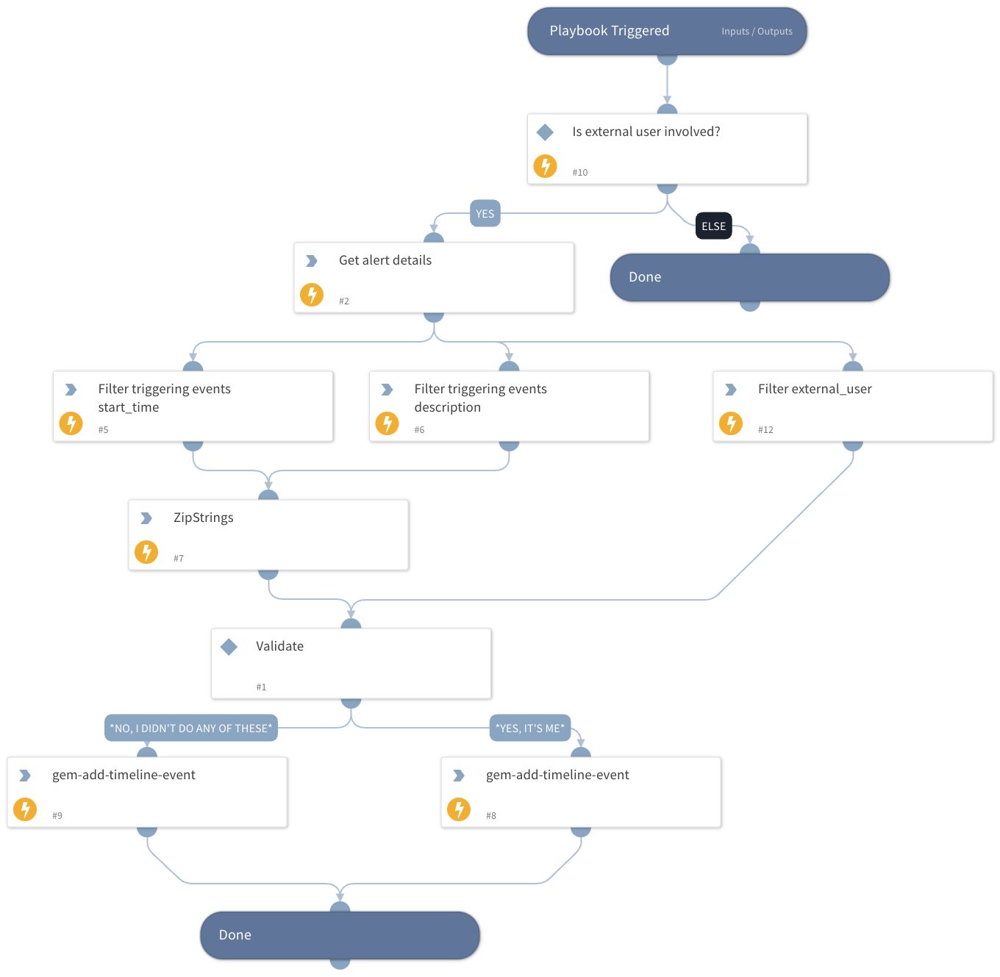

Get the triggering events of a Gem Alert and send a validation Slack message to the dev team.
The response will be added to the Gem Timeline.

## Dependencies

This playbook uses the following sub-playbooks, integrations, and scripts.

### Sub-playbooks

This playbook does not use any sub-playbooks.

### Integrations

* Gem

### Scripts

* ZipStrings
* Set

### Commands

* gem-add-timeline-event
* gem-get-alert-details

## Playbook Inputs

---

| **Name** | **Description** | **Default Value** | **Required** |
| --- | --- | --- | --- |
| User | Slack user to send validation for |  | Required |

## Playbook Outputs

---
There are no outputs for this playbook.

## Playbook Image

---

